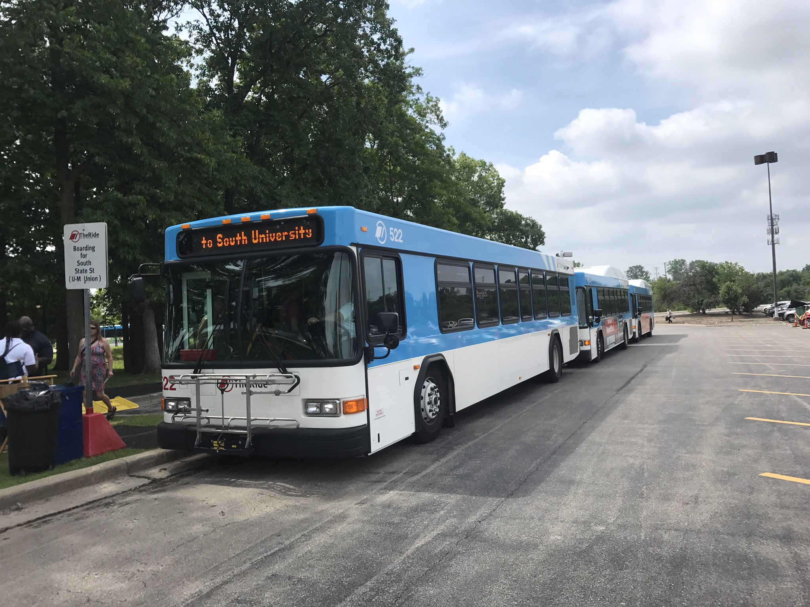

# Commuting Around Campus and Ann Arbor {#commuting}

## Walking
1. As central campus and downtown Ann Arbor border each other, it is very easy to walk between these parts of the city
    a. Campus integrated with Ann Arbor streets for more organized travel
2. On campus, there are safety posts (black posts with a bright blue light) along the streets allow you to get instant direct contact with security
3. For an interactive map of campus and of Ann Arbor see https://maps.studentlife.umich.edu/

## Blue Buses
1. Free with M Card
2. Track bus routes in real time on the Magic Bus Website
    a. https://mbus.ltp.umich.edu/home

## TheRide
1. TheRide is Ann Arbor's public bus system that provides cheap and easy to travel between cities within Michigan
2. It is free for students with an MCard
3. Their website features a "Plan My Trip" feature that allows you to enter a departure location and a destination and will tell you which bus route to take to get to your destination
4. See their website https://www.theride.org/ for maps & schedules, fares & passes, and more information on how to ride

{width=50%} {width=50%}

## Cars/Parking
1. Parking Passes: https://ltp.umich.edu/parking/permit-parking/
    a. 4 Tiers of passes available for faculty, students, and staff based on seniority: Gold, Blue, Yellow, Orange
    b. Graduate students are eligible for 4 types of parking permits with annual costs
        i. Yellow/After Hourmore infs – $237
        ii. Student Storage – $234
        iii. Orange – $84
        iv. After Hours – $70 
2. Understanding Michigan Car Insurance
    a. Michigan is considered a “no-fault” which makes insurance rates in the state significantly higher than average 
        i. https://www.michigan.gov/-/media/Project/Websites/autoinsurance/PDFs/FIS-PUB_0202a.pdf?rev=f0fb2628817f479d92ec040006bae492
3. Plate and License Transition
    a. https://www.secstates.com/MI_DMV_Michigan_Department_of_Motor_Vehicles

## Spin Scooters
1. Download the app on iOS or Android for a fun way to zip around campus
2. Cost: $1 to unlock the scooter + 15¢ per minute to ride
3. For more information: https://www.spin.app/

## Rideshare: Uber & Lyft {#rideshare}
1. Similar to a taxi, but you can request a driver from the app on a smartphone to pick you up from any destination and take you to any destination
    a. Download Uber and Lyft app on iOS or Android
2. If you want to guarantee a ride for a future date/time, you can schedule a future ride through both of these apps
3. Uber website: https://www.uber.com/
4. Lyft website: https://www.lyft.com/

