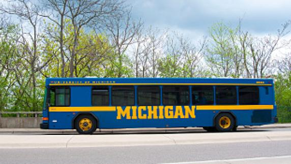
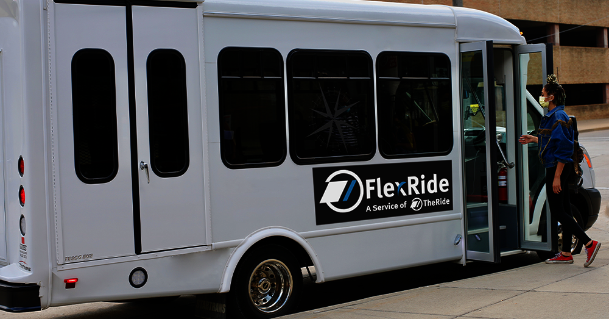
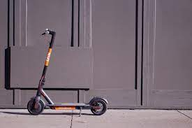

# Commuting Around Campus and Ann Arbor {#commuting}

## Walking
1. Safety posts along the streets allow you to get instant direct contact with security
2. Campus integrated with Ann Arbor streets for more organized travel
3. https://maps.studentlife.umich.edu/

## Blue Buses
1. Free with M Card
2. Track bus routes in real time on the Magic Bus Website
3. https://mbus.ltp.umich.edu/home

## The Ride
1. Cheap and easy to travel between cities within Michigan
2. https://www.theride.org/

## Cars/Parking
1. Parking Passes: https://ltp.umich.edu/parking/permit-parking/
    1. 4 Tiers of passes available for faculty, students, and staff based on seniority: Gold, Blue, Yellow, Orange
    1. Graduate students are eligible for 4 types of parking permits with annual costs
        1. Yellow/After Hours – $237
        2. Student Storage – $234
        3. Orange – $84
        4. After Hours – $70 
2. Understanding Michigan Car Insurance
    1. Michigan is considered a “no-fault” which makes insurance rates in the state significantly higher than average 
        1. https://www.michigan.gov/-/media/Project/Websites/autoinsurance/PDFs/FIS-PUB_0202a.pdf?rev=f0fb2628817f479d92ec040006bae492
3. Plate and License Transition
    1. https://www.secstates.com/MI_DMV_Michigan_Department_of_Motor_Vehicles

## SPIN Scooters
1. Download the app on iOS or Android for a fun way to zip around campus

