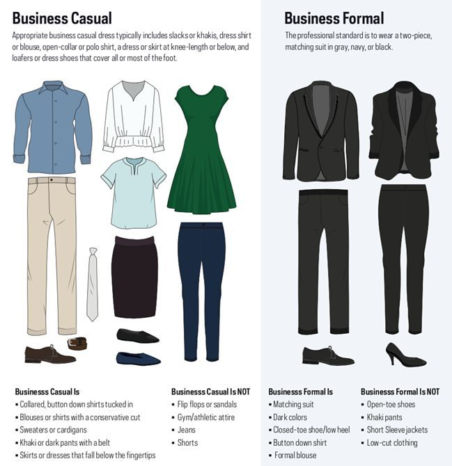

# Academics {#academics}

## Orientation

Orientation will take place some point in late June and will be an introduction to the Ross School of Business and the University of Michigan as a whole. It will be four days long and will consist of workshops, team bonding activities, and informational sessions.

You will be invited to join a canvas module and will receive most of your information from there. If you have any questions, you can ask your Student Success Adviser or email rossmban@umich.edu.

Some of the orientation will have you be mingled with the rest of the One Year Master's students and other parts of it will just be your cohort. 

There will be some prep work that you must do before orientation, so keep an eye out for some emails and updates on your canvas module.

Make sure to bring business casual clothes! There is a dress code for some of the days.

{width=50%}

## What to Expect from Summer Classes

The summer classes serve as an introduction to business and the classes you will be taking in the future. You will not have to register for your classes, you will be automatically enrolled in them.

In 2022, the summer classes were:

* BA 500 - Business Immersion
    + The purpose of this course, therefore, is to help you begin to learn the language and culture of business, by immersing you into the business world. More specifically, it aims to: develop a foundation of business terms, explore the distinctive cultural features of business, and situate yourself professionally in business.
* MBAN 501 - Software Teams and Project Management
    + This course has two interrelated components: Team
dynamics and managing software development projects; presented in an integrated fashion. Team dynamics content will include such topics as the emergence of behavioral norms in project teams, team decision making, potential sources of conflict, and managing conflict constructively. Project management content will include topics such as Lean Startup principles and Minimum Viable Products, development approaches (e.g. agile, traditional, waterfall), integrating software tools and dealing with the inevitable surprise changes to timing, scope and content.
* MBAN 550 - Introduction to Data Programming
    + In this course students are introduced to the fundamentals of data programming in python, with a focus on business applications. Students will learn the use of functions, user-defined classes, and common python data structures. Students will become familiar with common data science libraries, and the basics of web data access.
* MBAN 551 - Advanced Spreadsheet
    + Business analytics has grown into a major functional area in many companies and its tool set is rapidly expanding, but spreadsheets remain among the most widely used tools in business analytics. You can think of Microsoft Excel as a Swiss Army knife that is accessible on almost every computer and offers a variety of important tools in one place:
        + Automating recurring business calculations and developing/prototyping decision models,
        + Performing sensitivity/scenario analysis and mathematical optimization on a spreadsheet model,
        + Summarizing data in visual or tabular form to draw insight and creating interactive dashboards,
        + Loading data directly from a variety of live sources (web pages, online/offline database formats, etc.)
and automating the process of cleaning, transforming, parsing, merging the data in preparation for
analysis.
        + Ability to work with normalized data (scattered across separate tables) using table relationships,
        + Ability to work with very large datasets (think several GB) efficiently,
        + Excel also offers two coding languages: VBA to create new custom functions or automate recurring
tasks, and DAX for advanced/custom data processing and enhancing the capabilities of Pivot Tables.

## Summer Career Opportunities

The [Career Development Office](https://sites.google.com/umich.edu/cdo-specialtymasters/home) will be your source of information for all things career. They can help you with things like recruiting, resume building, networking, interview prep, and more.

Your program will have their own dedicated career coach to help you with all these things. You can make meetings with them to answer any questions you have, get feedback on your resume, or chat about potential career opportunities. 

There will also be several career building sessions throughout the summer that you can attend. Some of them might be required for one of your courses. These sessions cover a range of topics, including but not limited to:

* Two Hour Job Search
* Career Ingredients
* Resume
* LinkedIn
* Interview Storytelling