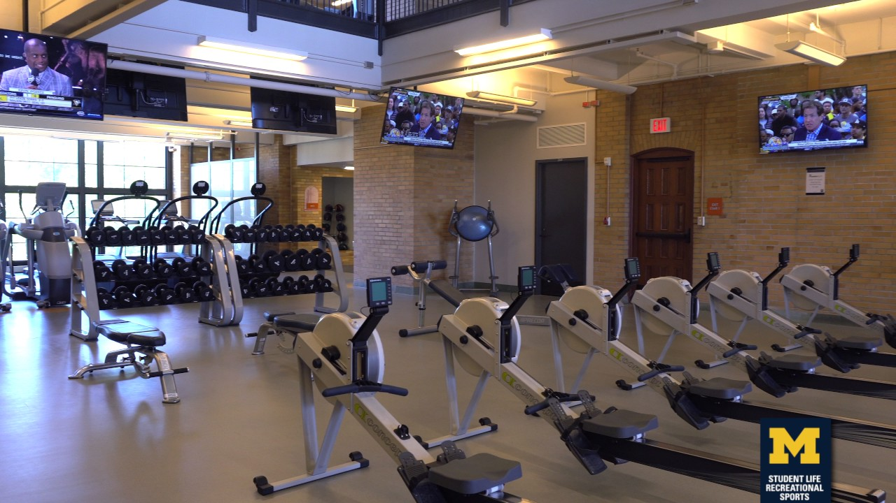
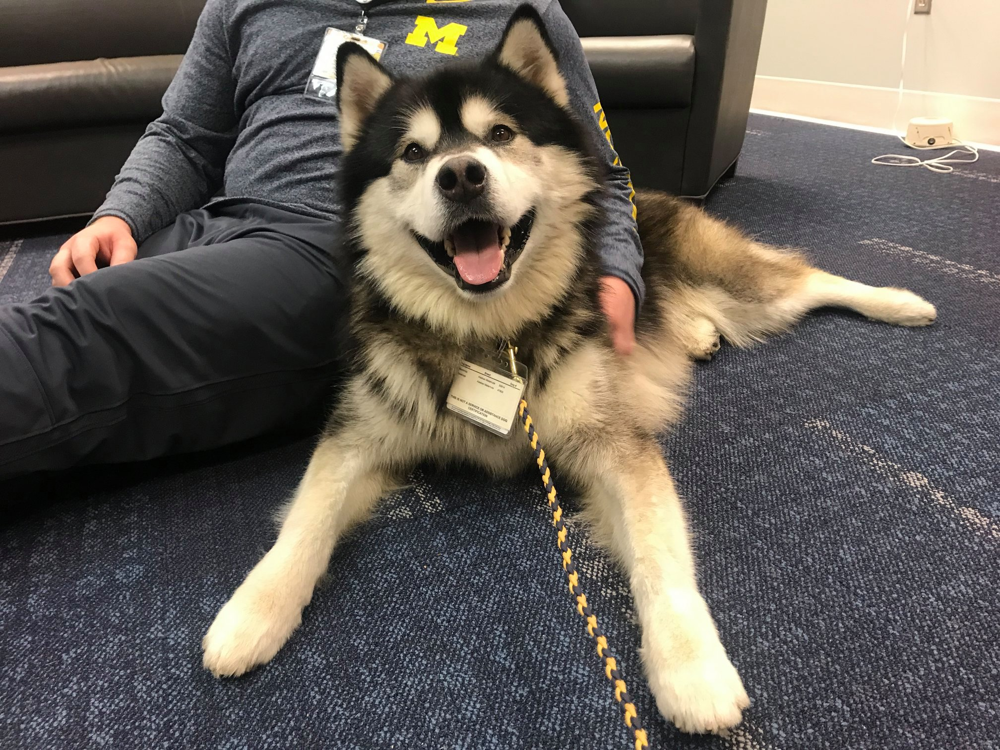

# Student Resources {#studentresources}

## Gym Membership (free with tuition)

- Gain access the day your classes begin, membership is automatic, no sign up required	
- Access to three different gyms on campus
    - Central Campus Recreation Building (CCRB)
    - Tennis and Basketball courts on Palmer Field (free)
    - Intramural Sports Building (IMSB)
    - North Campus Recreation Building (NCRB)
- Extra Items (for extra fee):
    - Group‑X classes (usually $50/semester)
    - Intramural Sports
    - Small Group Training classes
    - Personal Training services.
- Website: https://recsports.umich.edu/fitness/policies/ 

{width=50%}

## Printing

- Printing stations all across campus
- $43 worth of printing per semester
- Use MPrint to print at each location and find nearby printers
- MPrint website: https://mprint.umich.edu/ 

## University Health Service

- Campus health and wellness resour*ce, offering comprehensive clinical services plus support for your well-being. 
- Most services are free for currently enrolled U-M students
- UHS website: https://uhs.umich.edu/ 

{width=50%}

## Welcome Wednesdays

- The alumni center gives free coffee, tea, and bagels to students every Wednesday, just bring your MCard
- See https://alumni.umich.edu/students/welcome-wednesdays/ for more details

## Passport to the Arts

- Free tickets to various arts and culture events throughout Ann Arbor
- Check dorm community centers or Pierpont Commons
- See http://artsatmichigan.umich.edu/programs/passport/ for more details

## Student Support Services

- [Counseling and Psychological Services (CAPS)](https://caps.umich.edu/)
- [Services for Students with Disabilities (SSD)](https://ssd.umich.edu/)
- [Office of Student Conflict Resolution (OSCR)](https://oscr.umich.edu/)
- [Wolverine Support Network](https://www.umichwsn.org/)

{width=50%}
