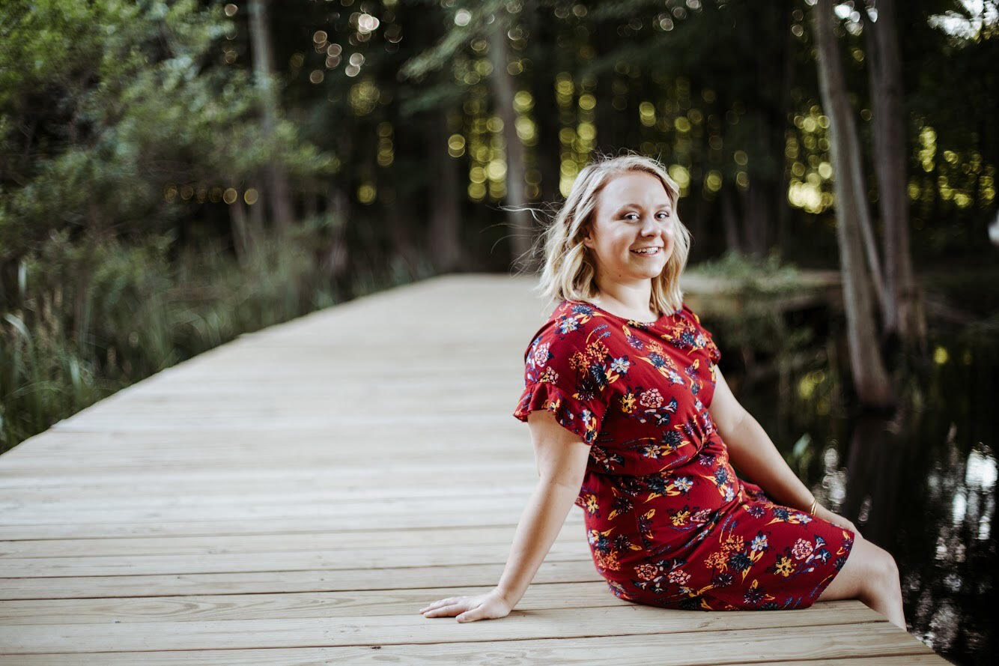

# About Us {-}

## Kami Ziolkowsi

Hello! My name is Kami Ziolkowski and I am a graduate student in the Business Analytics program at the Ross School of Business. I recently graduated from the University of Michigan with a degree in Data Science and a minor in Polish.

In my free time I like to *dance*, bake, and work on my bullet journal. I'm interested in music, coding, and learning really random facts.

A few fun facts about myself:

1. I sneeze when I step into the sun
2. I have been to 30 of the 50 states
3. I have two cats named **Rue** and **Mr. Man**
4. My favorite color is burgundy

## Raj Kadian

[ Raj's about me page ]

## Yuqi Shi

Background

My name is Yuqi Shi. I was born and raised in Qingdao, a coastal city in Eastern China, and I graduated with a Bachelor of Business Administration degree in Supply Chain Management & Technology and Operations Management from the University of Wisconsin - Madison (Go Badgers!). Hoping to be a maritime logistic analyst, I'm pursuing my master's degree in Business Analytics at the University of Michigan, Ross School of Business (Go Blue!).

My hometown has the seventh largest commercial port in the world. When I was a kid, I used to sit by the dock, watching the sparkling water imprints left by hundreds of container ships in the setting sun, and forget about time. I hope that one day, with my knowledge and ability, I can contribute to constructing a more efficient and advanced Qingdao Port. 

Other

I love travelling. My friends always joke that I should consider majoring in tourism management. I enjoy "measuring the world" as Alexander Humboldt says and seeing the wonders of the road. I once drove to the depths of the Mongolian prairie, and from Sichuan Province across the Tibetan Plateau to the roof of the world - Mount Everest (although only to the base camp). 

In the three years since I came to the US, I have left my footprints in 45 states, exploring glaciers in the Arctic Circle in Alaska and appreciating the fireworks in front of Cinderella Castle in Florida. If you are also a traveler, please get in touch with me, let's share what we've seen, and plan our next journey :)

{width=47.5%} {width=47.5%}

## Rory Meyer
{width=50%}

Hi! My name is Aurora Meyer, but I prefer to go by Rory. I am a graduate student at the Ross School of Business pursuing a Masters in Business Analytics. This past April, I graduated with a degree in Biomedical Engineering from the University of Michigan. I also completed a minor in Computer Science. During my time at Michigan thus far, I learned how to code (the basics) in MATLAB, C++, Python, and HTML + JavaScript. So, I am excited to add R to my list of languages this summer!

I am from Washington D.C. I have 3 older siblings (2 sisters and a brother), a dog named Belle, and a cat named Daisy. After college, I would love to move back to the east coast, but I'm not quite sure where yet. I am also considering moving abroad, likely somewhere in Europe, for a few years since I never had the opportunity to study abroad during undergrad.

Some fun facts about me:

- Italian is my favorite cuisine.
- My favorite ice cream flavor is chocolate chip cookie dough.
- I love to go skiing in Colorado in the winter.
- I prefer a lake vacation over a beach vacation.
- I want to visit Australia one day.

## Kian Tabatabai

**Background**

My name is *Kian Tabatabai*. Yes, a persian name, but not quite 100% persian genes. My mom and dad were both immigrants from Taiwan and Iran, respectively. A look at my face can foster ambiguity about my ethnic background. My ethnic background played a large role in my upbringing in an otherwise small, conservative town. I grew up in York, PA which is about 45 minutes South of Harrisburg, PA. Throughout my life, I was heavily involved in high school extracurricular activities such as highschool soccer and the Math Club. This is where I also found my passions for **business and finance**. 

**Education**

I graduated from the *University of Pittsburgh* in 2021 with a business degree in **Finance**. There, I participated in a research lab as a data analyst which led me to find my passion for data science! I also participated in a student run club called *Panther Equity*. In our weekly meetings, we would work in teams to deliver stock pitches to the entire organization with the possibility of adding to our student-managed portfolio. Currently, I am an MBAn student at the *Ross School of Business* with an expected graduation date of April 2023. Here, I plan to cultivate my knowledge in both finance and technology!

**Interests**

Some of my interests outside of the classroom include **fitness**, **investing**, **videogames**, and **performance cars**. I am a regular gym goer that enjoys to meet others and learn about their fitness goals and journey. I found my passion for fitness around the same time I learned about trading on the stock market (about 17 years old). Since I executed my first trade, I have never stopped reading market news and doing my own research on trading strategies! Finally, in my moments of extra free time, I enjoy playing videogames with my friends online and read about the latest breakthroughs in the performance vehicles industry!

